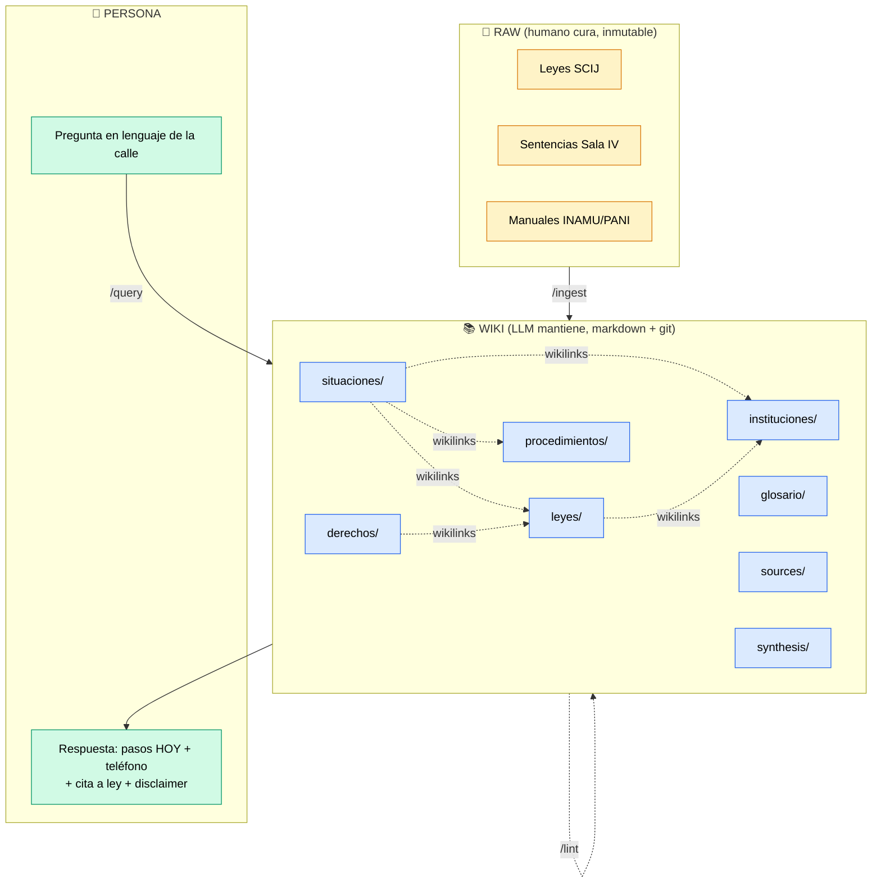
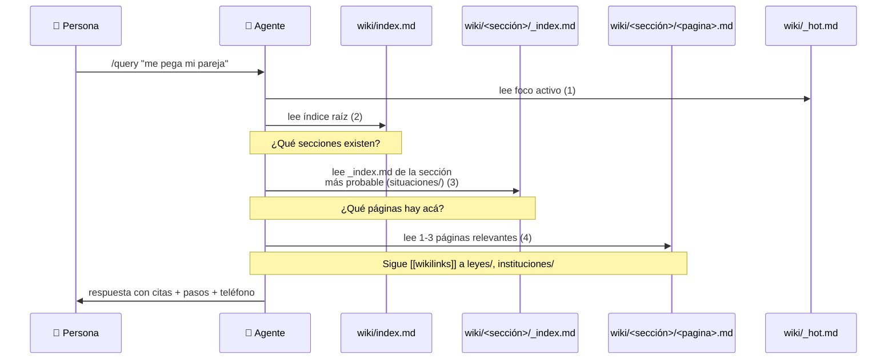
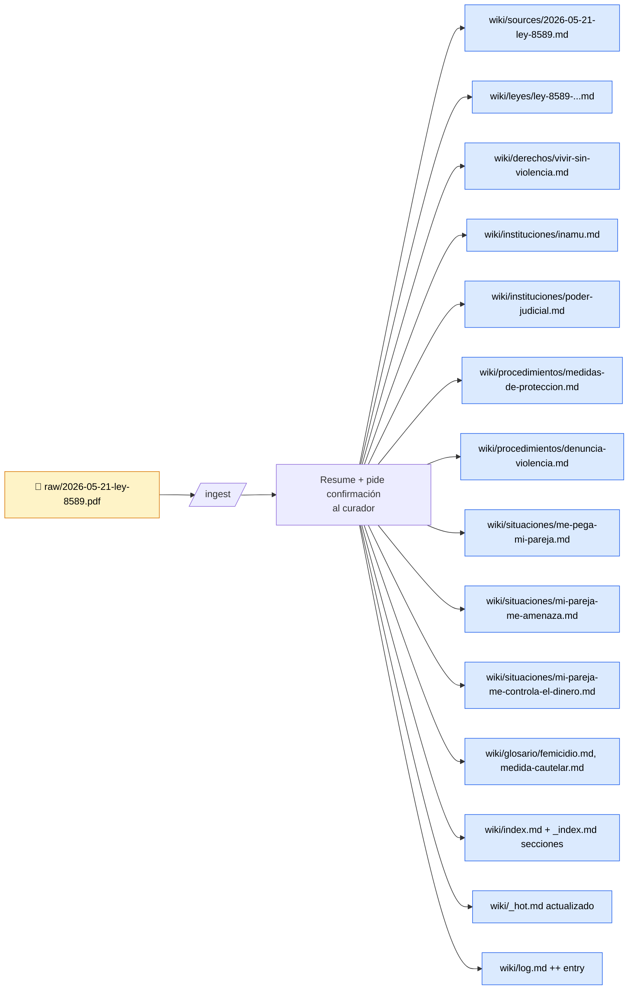

# 02 — Arquitectura

> Cómo está construido el wiki y por qué cada decisión técnica.

---

## El patrón base: LLM Wiki (Karpathy, abril 2026)

Andrej Karpathy (co-fundador de OpenAI) propuso un patrón para mantener bases de conocimiento personales con LLMs. **Tres capas:**



**Las reglas del patrón:**
- El LLM **escribe y mantiene** todo el wiki.
- El humano **nunca edita** páginas del wiki directamente (en teoría).
- El humano **nunca permite** al LLM modificar `raw/`.
- Un archivo schema (`CLAUDE.md` / `AGENTS.md`) define convenciones, workflows y reglas. **Es el "código fuente" del comportamiento del agente.**

---

## Por qué no usamos RAG

| Eje | RAG clásico | LLM Wiki |
|---|---|---|
| **Cuándo se procesa** | En query time (cada pregunta) | En ingest time (una vez) |
| **Estado** | Vector DB + chunks | Markdown plano + git |
| **Cross-references** | Reconstruidas en cada respuesta | Persistentes en `[[wikilinks]]` |
| **Contradicciones** | Invisibles (el LLM no compara fuentes) | Explícitas (strike-through + nueva cita) |
| **Auditabilidad** | Difícil ("¿qué chunk usó?") | Trivial (`grep`, git blame, graph view) |
| **Infraestructura** | Embeddings + DB + pipeline | Archivos + un agente |
| **Versionado** | Re-indexar todo | `git diff` |
| **Acumulación** | Cero | Total — cada ingest enriquece el wiki entero |

**Para nuestro caso de uso (información legal con alto costo del error):**
- RAG puede alucinar artículos inexistentes; el wiki obliga a citar.
- RAG no detecta contradicciones entre fuentes; el wiki las explicita.
- RAG es opaco; el wiki es 100% auditable por humanos.

---

## Navegación de 3 saltos (cómo el agente encuentra cosas)

A diferencia de RAG (que necesita embeddings y vector DB), Bitaya navega con **3 lecturas constantes**, sea el wiki de 10 páginas o de 500.



**Resultado:** retrieval con O(1) lecturas. Sin vector DB. Sin embeddings. Sin chunking.

---

## Flujo de ingest (cómo una sola ley toca 10-20 páginas)



Lo que para ChatGPT sería 1 respuesta efímera, para Bitaya son **12-15 páginas persistentes y cross-linkeadas** que sirven a todas las preguntas futuras sobre el tema.

---

## Anatomía del repo

```
Bitaya_LLM_Wiki/
│
├── CLAUDE.md                   ← SCHEMA: el "código fuente" del agente
│                                  (audiencia, tono, workflows, reglas duras)
├── AGENTS.md                   → symlink a CLAUDE.md (compat con Codex/OpenCode/etc.)
├── README.md                   ← entrada principal del repo
├── .gitignore                  ← ignora .obsidian/workspace, .DS_Store, etc.
│
├── raw/                        ← CAPA 1: fuentes oficiales inmutables
│   └── assets/                    PDFs, imágenes, anexos
│
├── wiki/                       ← CAPA 2: markdown que el LLM mantiene
│   ├── index.md                   catálogo (lo lee primero en cada query)
│   ├── log.md                     append-only de ingests/queries/lints
│   ├── situaciones/               🆘 PUERTA DE ENTRADA — "me pasa esto"
│   ├── derechos/                  ⚖️  derechos garantizados
│   ├── leyes/                     📜 leyes, códigos, artículos
│   ├── instituciones/             🏛️  PANI, INAMU, MTSS, CCSS, etc.
│   ├── procedimientos/            🧭 cómo denunciar, cómo reclamar
│   ├── glosario/                  📖 jerga legal en castellano simple
│   ├── sources/                   📂 una página por cada fuente ingerida
│   └── synthesis/                 🧪 comparaciones/guías generadas
│
├── _templates/                 ← plantillas tipadas (8 tipos)
│   ├── situacion.md               ⭐ la más importante
│   ├── derecho.md
│   ├── ley.md
│   ├── institucion.md
│   ├── procedimiento.md
│   ├── termino.md                 (para glosario)
│   ├── source.md
│   └── synthesis.md
│
├── .claude/commands/           ← slash commands del agente
│   ├── ingest.md
│   ├── query.md
│   └── lint.md
│
└── docs/                       ← documentación del proyecto (este folder)
    ├── 01-PITCH.md
    ├── 02-ARQUITECTURA.md
    ├── 03-GUIA-DE-USO.md
    └── 04-DEMO.md
```

---

## Decisiones de diseño específicas al dominio

### 1. `situaciones/` como puerta de entrada

La gente describe su problema en lenguaje natural, no por nombre de ley:

- ❌ `violencia-intrafamiliar.md`
- ✅ `me-pega-mi-pareja.md`

Cada situación responde, en orden estricto:
1. ¿Esto está mal?
2. ¿Qué te protege?
3. Qué hacer HOY
4. A quién llamar / dónde ir
5. Qué llevar
6. Si no te hacen caso

### 2. Frontmatter YAML estructurado

```yaml
---
title: ...
type: situacion | derecho | ley | institucion | procedimiento | termino | source | synthesis
poblacion: [mujeres, niñez, adultos-mayores, discapacidad, indigenas, migrantes, lgbtiq, trabajadores]
urgencia: alta | media | baja
sources: [[sources/...]]
status: stub | draft | revisado
revisor: <quién validó esto>
ultima_verificacion: YYYY-MM-DD
---
```

→ Permite queries con Dataview ("dame todas las situaciones de alta urgencia para mujeres").

### 3. Reglas duras codificadas en `CLAUDE.md`

- "Toda afirmación legal lleva cita o no se publica."
- "Toda página pública termina con el aviso legal obligatorio."
- "Nunca modificar `raw/`."
- "Nunca borrar páginas; marcar `status: obsoleta`."
- "Toda institución debe traer teléfono + horario + opción sin internet."

Estas reglas viven en el schema, no en código. **Cambiar el comportamiento del agente = editar markdown.** No deploy, no config files.

### 4. Detección de emergencia en `/query`

Si la pregunta menciona violencia activa, riesgo a niñez o persona herida, **la primera línea de la respuesta es el teléfono de emergencia** (911 / 800-INAMU-00 / 1147). Antes que cualquier explicación.

### 5. `log.md` parseable con grep

Cada entrada empieza con `## [YYYY-MM-DD] <op> | <título>`, así:

```bash
grep '^## \[' wiki/log.md | tail -20    # últimos 20 eventos
grep 'ingest' wiki/log.md | wc -l       # cuántas fuentes ingeridas
```

Sin DB. Sin dashboard. Bash + grep alcanzan.

---

## Stack técnico

| Componente | Elección | Por qué |
|---|---|---|
| **Editor** | [Obsidian](https://obsidian.md) | Local-first, markdown nativo, graph view, plugin Dataview, gratis |
| **Agente** | [Claude Code](https://claude.com/claude-code) | Lee `CLAUDE.md` automáticamente, slash commands nativos, edita archivos |
| **Almacenamiento** | Filesystem + git | Versionado gratis, sin DB, portable |
| **Búsqueda** | Markdown + `index.md` + grep | Suficiente hasta ~hundreds de páginas; escalable a [qmd](https://github.com/tobi/qmd) si crece |
| **Formato** | Markdown + YAML frontmatter | Lee humano y LLM con la misma facilidad |
| **Lenguaje** | Español de Costa Rica | Es el lenguaje de la audiencia |

**Costo de infraestructura:** $0 (corre local). Solo se paga el uso del LLM, y solo en `/ingest` y `/query`.

---

## Por qué este stack escala

- **Markdown es lingua franca.** El mismo wiki sirve para:
  - Un sitio Astro/Docusaurus público (deploy a Vercel).
  - Un bot de WhatsApp (queries → respuestas con citas).
  - Una app móvil offline-first.
  - Material impreso para zonas rurales.
- **Git da colaboración y auditoría.** PRs de ONGs, revisores legales por commit.
- **El schema en `CLAUDE.md` es portable** entre agentes (Claude Code, Codex, OpenCode, Gemini CLI).
- **Cero lock-in.** Si mañana sale un LLM mejor, cambiás de agente y el wiki sigue funcionando.

---

## Referencias

- [Karpathy, *LLM Wiki* gist (abril 2026)](https://gist.github.com/karpathy/442a6bf555914893e9891c11519de94f) — patrón original
- [Beyond RAG: How Karpathy's LLM Wiki Pattern Builds Knowledge That Actually Compounds](https://levelup.gitconnected.com/beyond-rag-how-andrej-karpathys-llm-wiki-pattern-builds-knowledge-that-actually-compounds-31a08528665e)
- [obsidian-wiki framework (Ar9av)](https://github.com/Ar9av/obsidian-wiki) — implementación de referencia
- [Vannevar Bush, *As We May Think* (1945)](https://www.theatlantic.com/magazine/archive/1945/07/as-we-may-think/303881/) — el Memex, ancestro conceptual
